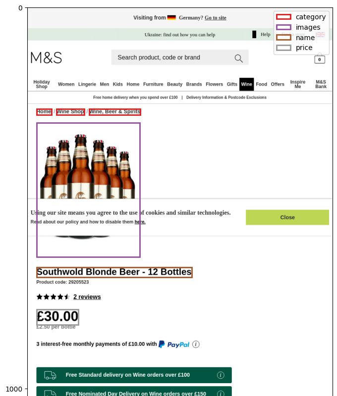
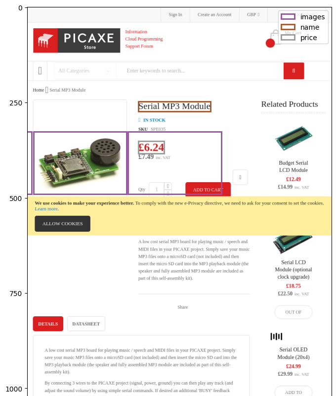

# AI-based web extractor

This repository contains source code of AI-based structured web data extractor.

## Directory structure

t.

## Quickstart

### Running the pre-trained demo locally


Open a web browser and navigate to <http://localhost:3000/>.

For more details, see [`docs/demo/run.md`](docs/demo/run.md).

### Training on the SWDE dataset

```bash
docker pull janjones/awe-gradient
docker run --rm -it -v awe:/storage -p 3000:3000 janjones/awe-gradient bash
```

Then, run inside the Docker container:

```bash
git clone https://github.com/jjonescz/awe .
git clone https://github.com/jjonescz/swde-visual data/swde
python -m awe.training.params
python -m awe.training.train
# Model is trained, now you can run the demo.
cd js
pnpm install
DEBUG=1 pnpm run server
```

For more details, see

1. [`docs/dev/env.md`](docs/dev/env.md),
2. [`docs/data.md`](docs/data.md),
3. [`docs/train.md`](docs/train.md), and
4. [`docs/demo/run.md`](docs/demo/run.md).

## Examples

Generated by the [live demo](https://bit.ly/awedemo).




